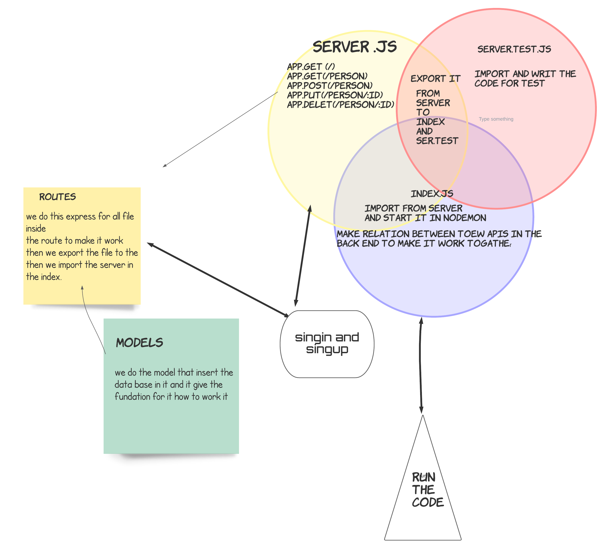

# basic-auth
## notes 

1. we learn about SQL
2. download 
    >"pg": "^8.7.1",

    >"sequelize": "^6.6.5",

    >"sequelize-cli": "^6.2.0",

    >"sqlite3

    > auth for singin 

3. new command for data base 

4. Install The Postgres Database Server 

5.  how to make singin and singup for data base 

## deployment links

- qusai-basic-api-server --> [repo](https://github.com/qusaiqeisi/api-server)
- PR --> [pull requist](https://github.com/qusaiqeisi/api-server/pull/2)
- repo action -->[action](https://github.com/qusaiqeisi/basic-api-server/runs/3302534501)
- heruko --> [heruko](https://qusai-api-server.herokuapp.com/)

## MUL

